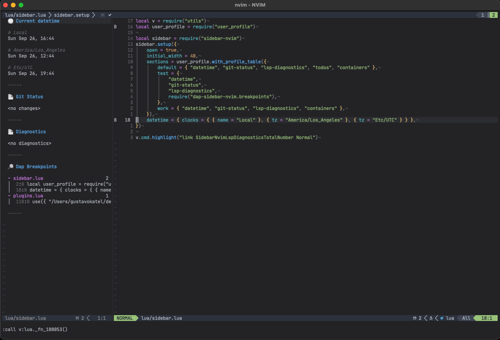

# Dap Sections for [sidebar.nvim](https://github.com/GustavoKatel/sidebar.nvim)

### Requirements:

- [nvim-dap](https://github.com/mfussenegger/nvim-dap)
- [sidebar.nvim](https://github.com/GustavoKatel/sidebar.nvim)

## Available Sections

### Breakpoints



Show current breakpoints into the sidebar

#### Configuration

```lua
require("sidebar-nvim").setup({
    ...
    sections = { "datetime", "git-status", "lsp-diagnostics", require("dap-sidebar-nvim.breakpoints") },
    ...
})
```

